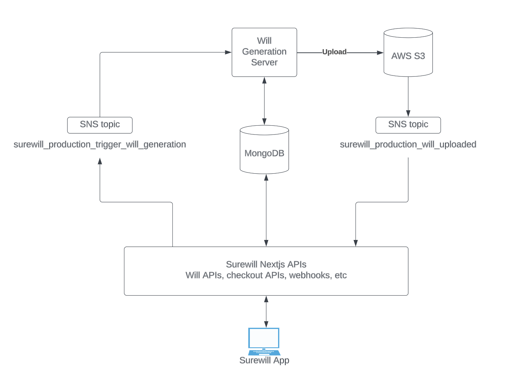

# surewill-monorepo

1. Surewill Web App - [get started](/packages/app/)
2. Surewill Marketing Site - [get started](/packages/website)
3. Surewill Will Generation Service - [get started](/packages/server)

## Third-party services
1. [Vercel](https://vercel.com/tigerheart) for hosting the Website and Web App
2. [Render](https://render.com/) for hosting the Will Generation Service (Express server)
3. [MongoDB Atlas](https://www.mongodb.com/atlas) for hosting the database
4. AWS resources:
    - S3 buckets to store Will PDF documents
    - SNS topic for triggering Will creation
    - SNS topic for triggering Will created/updated emails
    - SQS as a dead-letter queue for failed SNS notifications
5. [Sanity](https://www.sanity.io/) as a CMS 
6. [Stripe](https://dashboard.stripe.com/) for payments
7. [Clerk](https://clerk.com/) for authentication
8. [Sentry](sentry.io) for error monitoring

## Troubleshooting
Before troubleshooting a problem, make sure that you're familiar with the System Architecture outlined below.

The two error cases below are when a payment has been made successfully, but the Will is not generated as expected. If a Will error like this occurs, it is likely that something has gone wrong during Will generation and so your first action should be to check the Sentry logs for `surewill-server` and/or the server logs on the [surewill-production API on Render](https://dashboard.render.com/). See below for more thorough troubleshooting solutions.

### 1. If a Will fails to be generated after a successful payment
1. Check the Stripe webhook logs
2. Check the `surewill_production_trigger_will_generation` topic in AWS SNS and check its status. If an SNS message fails 3 times, it will be held in a dead-letter queue (DLQ) in SQS. Check here to see if there are any messages - if so, the message will include the Will ID of the Will that failed to generate.
3. Check the logs on the Will generation server deployed on Render
4. Check in `surewill-production-wills` AWS S3 bucket if the Will document PDF has been uploaded. Wills documents are stored as `{willId}/will.pdf`. If the Will document does not exist here, then check the `surewill-production-logs` for possible error logs.

### 2. If a Will is generated incorrectly
If a Will is generated incorrectly, then you should start your troubleshooting by first viewing this Will as a HTML webpage. A Will can be viewed at the following URL: `https://app.surewill.com.au/documents/[willId]?generationKey={GENERATION_KEY_UUID}`. Note that to view a Will like this, the following criteria has to be met:
1. The URL contains the correct `generationKey`, which can be found in MongoDB on the Will record.
2. The Will must have been paid for - marked as `COMPLETE_PAID` on the MongoDB record.

### How to: manually download an existing Will
You'll need to know the Will ID, which is the `_id` of the Will record in our MongoDB (you can search for the Will here by name, email, etc). Once you have the Will ID, go to the `surewill-production-wills` AWS S3 bucket and find the folder named with this Will ID. In that folder there will be one file called `will.pdf` which you can download using the Download or Open buttons.

### How to: manually trigger Will generation
Go to the `surewill_production_trigger_will_generation` topic in AWS SNS and click the Publish Message button. In the Message Body, enter the Will ID and click the Publish Message button. The Will ID is the `_id` of the Will record in our MongoDB (you can search for the Will here by name, email, etc).

## System Architecture + Will Generation
Some important points to understand the system and how Wills are generated:
- Wills are generated by an Express Server hosted on Render: [/packages/server](/packages/server). A Will is rendered as a page within `/documents/[willId]` in the Surewill App and the Will Generation server uses Puppeteer to navigate to this page and save it as a PDF (using a `generationKey` as authentication).
- A traditional server is used for Will generation instead of a serverless function for two main reasons:
    1. Will generation is a long-running process which might run for longer than a serverless function's maximum duration
    2. It uses Puppeteer library which is too big to be bundled into a serverless function
- Wills are always generated by sending a message to the SNS notification topic: `surewill_{ENV_NAME}_trigger_will_generation` which in turn calls the  `/webhook/sns` API on the Will Generation Server. Sending this SNS notification happens from multiple places:
    - The Stripe webhook after Will payment
    - The frontend API for checkout when Stripe is not involved i.e. a free Will using a coupon
    - The frontend APIs after a Will update that requires regenerating the Will
- After a Will is generated, it is uploaded to AWS S3. Each S3 upload sends a notification to another SNS topic: `surewill_{ENV_NAME}_will_uploaded` which in turn calls the `/api/webhook/sns` Surewill App Next.js API. This will send emails to relevant people with the Will file attached.

